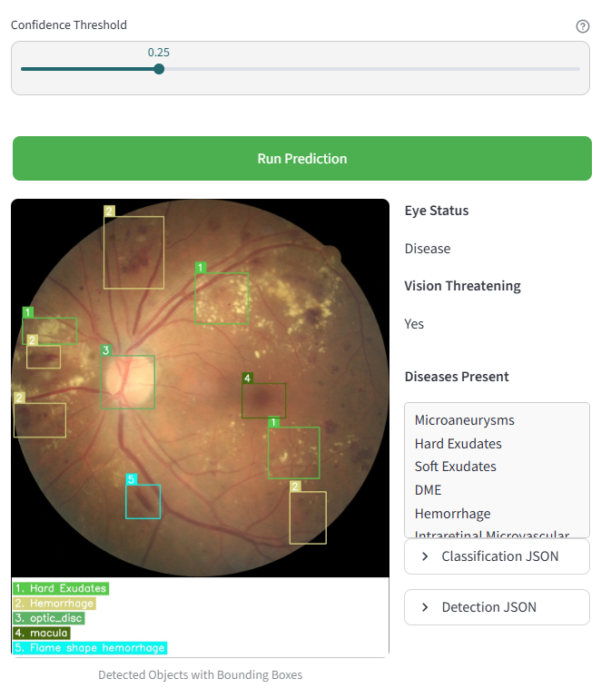
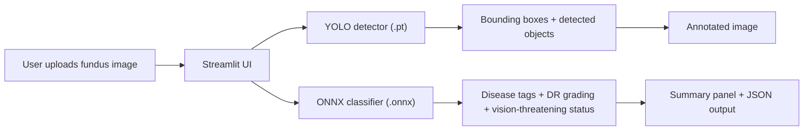

# Fundus Disease Detection

Streamlit-based prototype for demonstrating a fundus image screening model that combines lesion detection and retinal disease classification in a single workflow.

> This repository is a simple demo application intended to showcase the underlying model behavior. It is not the full production product, and it does not include the broader UX, workflow controls, integrations, reliability features, or other product-layer capabilities that exists in customer-facing deployments built around these models.

## Highlights

- Upload a retinal fundus image and run prediction from the browser
- Visualize detected findings with bounding boxes and a legend
- Review disease tags, DR grade, and vision-threatening status
- Use the app with login or continue as a guest
- Run locally even when Firebase or Google Drive are unavailable

## Preview



## What This Project Does

This application is designed as a simple clinical-style interface for retinal image analysis. A user uploads a fundus image, adjusts the confidence threshold, and runs prediction. The app then displays:

- an annotated output image with detected retinal findings
- disease presence summary
- vision-threatening assessment
- diabetic retinopathy grading output
- raw detection and classification JSON for inspection

The current app uses:

- a YOLO detector for localized findings
- an ONNX classification model for disease tags and grading logic

## Prototype Scope

This codebase should be read as a model demo, not as a complete product implementation.

What is included here:

- a minimal Streamlit UI
- model inference wiring
- annotated image output
- basic prediction summaries
- optional lightweight login and cloud hooks

What is intentionally not represented here:

- full customer product UX
- production workflow orchestration
- enterprise-grade auth and user management
- hardened cloud infrastructure and monitoring
- customer deployment integrations
- compliance, audit, or operational tooling
- product-specific guardrails, review flows, and support processes

## Architecture



## Repository Structure

```text
fundus_v2/
├── assets/
│   ├── logo.png
│   ├── logo_small.png
│   ├── retina_classifier.onnx
│   └── retina_detector.pt
├── pages/
│   ├── app.py
│   ├── functions.py
│   └── login.py
├── .streamlit/
│   ├── config.toml
│   └── secrets.toml
├── main.py
├── requirements.txt
└── README.md
```

## Tech Stack

- Python 3.13
- Streamlit
- Ultralytics YOLO
- ONNX Runtime
- OpenCV
- Pillow
- Firebase Admin SDK
- Google Drive API

## Application Flow

1. Open the app and log in, or continue as a guest.
2. Upload a fundus image.
3. Adjust the confidence threshold for object detection.
4. Click `Run Prediction`.
5. Review the annotated image and diagnostic summary.

## Features

- Multi-page Streamlit app with landing, login, and prediction flow
- Guest mode via `Continue without login`
- Optional Firebase-backed user storage
- Optional Google Drive upload for submitted images
- Local fallback for login when cloud credentials are unavailable
- Best-effort Google Drive upload that does not block prediction
- Lazy model loading to improve startup behavior
- Session-persistent results across Streamlit reruns

## Local Setup

### Create a virtual environment

```powershell
python -m venv .venv
```

### Install dependencies

```powershell
.\.venv\Scripts\python -m pip install -r requirements.txt
```

### Start the app

```powershell
.\.venv\Scripts\streamlit run main.py
```

## Configuration

The app supports two operating modes.

### 1. Local-only mode

No external credentials are required.

Behavior:

- login data falls back to `.streamlit/local_users.json`
- prediction still runs if Firebase is unavailable
- prediction still runs if Google Drive upload fails

### 2. Cloud-enabled mode

To enable Firebase and Google Drive integration, configure `.streamlit/secrets.toml` with:

- `firebase`
- `gcp_service_account`

## Operational Notes

- Model files are loaded only when prediction is requested.
- Google Drive upload failures are handled as non-blocking warnings.
- Prediction results are stored in session state so the output remains visible across reruns.
- The confidence slider affects future prediction runs; it should not clear the last displayed result.

## Deployment

Recommended targets:

- Streamlit Community Cloud
- Hugging Face Spaces
- Render
- Railway
- Docker or VM-based deployment

Vercel is not a good fit for this repository in its current form because the app is built around Streamlit and carries a large ML runtime footprint with model assets and dependencies such as Torch, OpenCV, and ONNX Runtime.

## Limitations

- Prediction quality depends on the trained weights included with the project.
- This repository does not include a public sample dataset for benchmarking.
- Firebase and Google Drive integrations require valid external credentials and service configuration.
- This app is a prototype for demo purposes and should not be interpreted as the full production product.
- This app is best treated as a screening/demo workflow unless validated in a proper clinical setting.

## Screenshot

Example prediction output with bounding boxes and disease summary:


## License

The original project metadata references `Apache-2.0`.
